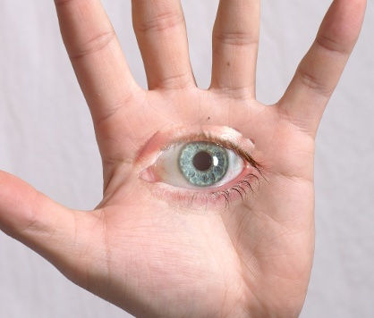
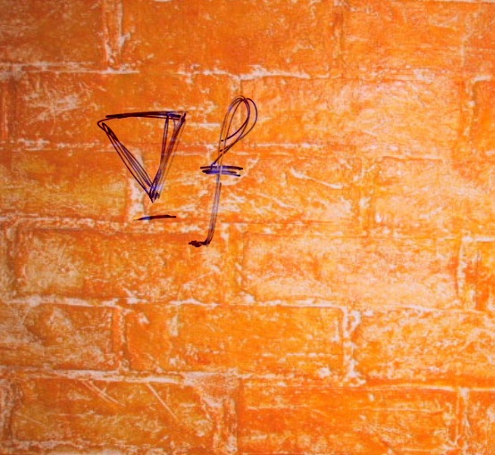
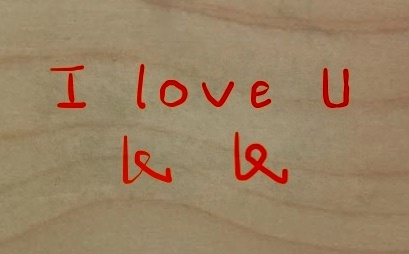

# Poisson Image Editing - a parallel implementation

> Jiayi Weng (jiayiwen), Zixu Chen (zixuc)

[Poisson image editing](https://www.cs.jhu.edu/~misha/Fall07/Papers/Perez03.pdf) is a technique that can blend two images together without artifacts. Given a source image and its corresponding mask, and a coordination on target image, this algorithm can always generate amazing result.

This project aims to provide a fast poisson image editing algorithm that can utilize multi-core CPU or GPU to handle a high-resolution image input.

## Installation & Usage

### Linux/macOS

```bash
# install cmake >= 3.4
# if you don't have sudo (like GHC), install cmake from source
# on macOS, type `brew install cmake`
$ git submodule update --init --recursive  # this is to initialize pybind11
$ pip install .
```

### Extensions

| Backend                                        | EquSolver          | GridSolver         | Dependency for installation                                  |
| ---------------------------------------------- | ------------------ | ------------------ | ------------------------------------------------------------ |
| NumPy                                          | :heavy_check_mark: | :heavy_check_mark: | -                                                            |
| GCC                                            | :heavy_check_mark: | :heavy_check_mark: | cmake, gcc                                                   |
| OpenMP                                         | :heavy_check_mark: | :heavy_check_mark: | cmake, gcc (on macOS you need to change clang to gcc-11)     |
| CUDA                                           | :heavy_check_mark: | :heavy_check_mark: | nvcc                                                         |
| MPI                                            | :heavy_check_mark: | :heavy_check_mark: | `pip install mpi4py` and mpicc (on macOS: `brew install open-mpi`) |
| [Taichi](https://github.com/taichi-dev/taichi) | :heavy_check_mark: | :heavy_check_mark: | `pip install taichi`                                         |

After installation, you can check `backend` option to verify, e.g.,

```bash
$ pie -h
[Taichi] version 0.9.2, llvm 10.0.0, commit 7a4d73cd, linux, python 3.6.8
usage: pie [-h] [-v]
           [-b {numpy,taichi-cpu,taichi-gpu,taichi-cuda,gcc,openmp,mpi}]
           [-c CPU] [-z BLOCK_SIZE] [--method {equ,grid}] [-s SOURCE]
           [-m MASK] [-t TARGET] [-o OUTPUT] [-h0 H0] [-w0 W0] [-h1 H1]
           [-w1 W1] [-g {max,src,avg}] [-n N] [-p P]
           [--mpi-sync-interval MPI_SYNC_INTERVAL] [--grid-x GRID_X]
           [--grid-y GRID_Y]

optional arguments:
  -h, --help            show this help message and exit
  -v, --version         show the version and exit
  -b {numpy,taichi-cpu,taichi-gpu,taichi-cuda,gcc,openmp,mpi}, --backend {numpy,taichi-cpu,taichi-gpu,taichi-cuda,gcc,openmp,mpi}
                        backend choice
  -c CPU, --cpu CPU     number of CPU used
  -z BLOCK_SIZE, --block-size BLOCK_SIZE
                        cuda block size (only for equ solver)
  --method {equ,grid}   how to parallelize computation
  -s SOURCE, --source SOURCE
                        source image filename
  -m MASK, --mask MASK  mask image filename (default is to use the whole
                        source image)
  -t TARGET, --target TARGET
                        target image filename
  -o OUTPUT, --output OUTPUT
                        output image filename
  -h0 H0                mask position (height) on source image
  -w0 W0                mask position (width) on source image
  -h1 H1                mask position (height) on target image
  -w1 W1                mask position (width) on target image
  -g {max,src,avg}, --gradient {max,src,avg}
                        how to calculate gradient for PIE
  -n N                  how many iteration would you perfer, the more the
                        better
  -p P                  output result every P iteration
  --mpi-sync-interval MPI_SYNC_INTERVAL
                        MPI sync iteration interval
  --grid-x GRID_X       x axis stride for grid solver
  --grid-y GRID_Y       y axis stride for grid solver
```

The above output shows all extensions have successfully installed via `--backend {numpy,taichi-cpu,taichi-gpu,taichi-cuda,gcc,openmp,mpi}`.

### Usage

We have prepared the test suite to run:

```bash
$ cd tests && ./data.py
```

This script will download 8 tests from GitHub, and create 10 images for benchmarking (5 circle, 5 square). To run:

```bash
$ pie -s test1_src.jpg -m test1_mask.jpg -t test1_tgt.jpg -o result1.jpg -h1 -150 -w1 -50 -n 5000 -g max
$ pie -s test2_src.png -m test2_mask.png -t test2_tgt.png -o result2.jpg -h1 130 -w1 130 -n 5000 -g src
$ pie -s test3_src.jpg -m test3_mask.jpg -t test3_tgt.jpg -o result3.jpg -h1 100 -w1 100 -n 5000 -g max
$ pie -s test4_src.jpg -m test4_mask.jpg -t test4_tgt.jpg -o result4.jpg -h1 100 -w1 100 -n 5000 -g max
$ pie -s test5_src.jpg -m test5_mask.png -t test5_tgt.jpg -o result5.jpg -h0 -70 -w0 0 -h1 50 -w1 0 -n 5000 -g max
$ pie -s test6_src.png -m test6_mask.png -t test6_tgt.png -o result6.jpg -h1 50 -w1 0 -n 5000 -g max
$ pie -s test7_src.jpg -t test7_tgt.jpg -o result7.jpg -h1 50 -w1 30 -n 5000 -g max
$ pie -s test8_src.jpg -t test8_tgt.jpg -o result8.jpg -h1 90 -w1 90 -n 10000 -g max
```

Here are the results:

| #    | Source image                                                 | Mask image                                                   | Target image                                                 | Result image                |
| ---- | ------------------------------------------------------------ | ------------------------------------------------------------ | ------------------------------------------------------------ | --------------------------- |
| 1    |  |  |  |  |
| 2    |  |  |  |  |
| 3    |  |  |  |  |
| 4    |  |  |  |  |
| 5    |  |  |  |  |
| 6    |  |  |  |  |
| 7    |  | /                                                            |  |  |
| 8    |  | /                                                            |  |  |


```bash
$ mpiexec -np 6 pie -s test3_src.jpg -t test3_tgt.jpg -o result.png -h1 100 -w1 100 -n 25000 -p 0 -b mpi --mpi-sync-interval 100
```

Grid size:
```bash
$ pie -s test3_src.jpg -t test3_tgt.jpg -o result.png -h1 100 -w1 100 -n 25000 -p 0 -b openmp -c 12 --method grid --grid-x 16 --grid-y 16
$ pie -s test3_src.jpg -t test3_tgt.jpg -o result.png -h1 100 -w1 100 -n 25000 -p 0 -b cuda --method grid --grid-x 4 --grid-y 128
```


## Algorithm detail

The general idea is to keep most of gradient in source image, while matching the boundary of source image and target image pixels.

The gradient is computed by
$$
\nabla(x,y)=4I(x,y)-I(x-1,y)-I(x,y-1)-I(x+1,y)-I(x,y+1)
$$
After computing the gradient in source image, the algorithm tries to solve the following problem: given the gradient and the boundary value, calculate the approximate solution that meets the requirement, i.e., to keep target image's gradient as similar as the source image. It can be formulated as
$$
A\vec{x}=\vec{b}
$$
where $A\in \mathbb{R}^{N\times N}$, $\vec{x}\in \mathbb{R}^N$, $\vec{b}\in \mathbb{R}^N$, where $N$ is the number of pixels in the mask. Therefore, $A$ is a giant sparse matrix because each line of A only contains at most 5 non-zero value.

$N$ is always a large number, i.e., greater than 50k, so the Gauss-Jordan Elimination cannot be directly applied here because of the high time complexity $O(N^3)$. People always use [Jacobi Method](https://en.wikipedia.org/wiki/Jacobi_method) to solve the problem. Thanks to the sparsity of matrix $A$, the overall time complexity is $O(MN)$ where $M$ is the number of iteration performed by poisson image editing.

In this project, we are going to parallelize Jacobi method to speed up the computation. To our best knowledge, there's no public project on GitHub that implements poisson image editing with either OpenMP, or MPI, or CUDA. All of them can only handle a small size image workload.

## Miscellaneous (for 15-618 course project)

Challenge: How to implement a fully-parallelized Jacobi Iteration to support a real-time image fusion?

- Workload/constrains: similar to the 2d-grid example demonstrated in class.

Resources:

- Codebase: https://github.com/Trinkle23897/DIP2018/blob/master/1/image_fusion/image_fusion.cpp, written by Jiayi Weng, one of our group members
- Computation Resources: GHC (CPU, GPU - 2080), PSC (CPU, GPU), laptop (CPU, GPU - 1060)

Goals:

- [x] 75%: implement one parallel version of PIE
- [x] 100%: benchmark the algorithm with OpenMP/MPI/CUDA implementation
- [ ] 125%: include a interactive python frontend that can demonstrate the result in a user-friendly style. Real-time computation on a single GTX-1060 Nvidia GPU.

Platform choice:

- OS: Linux, Ubuntu machine
- Language: C++/CUDA for core development, Python for interactive frontend

Schedule:

- 3.28 - 4.9: implement parallel version of PIE (OpenMP, MPI, CUDA)
- 4.11 - 4.22: benchmarking, optimizing, write Python interactive frontend
- 4.25 - 5.5: write report
