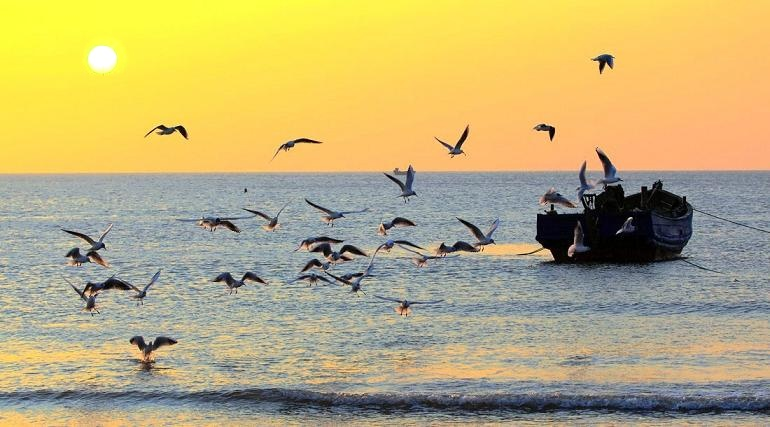
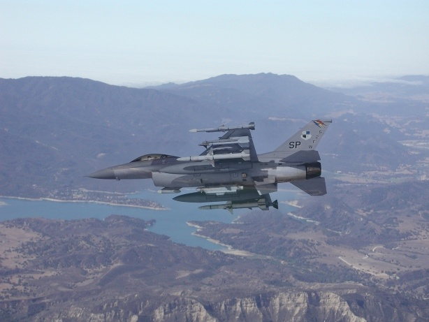
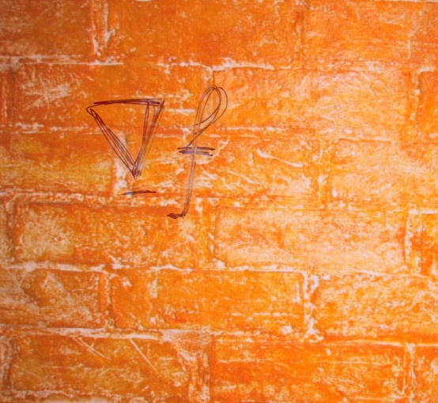
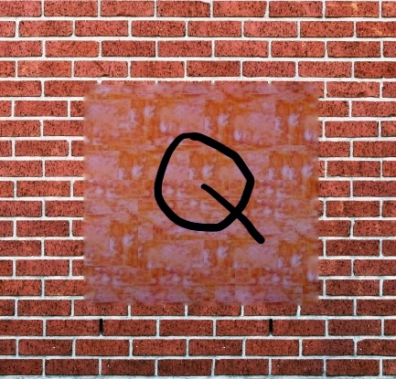
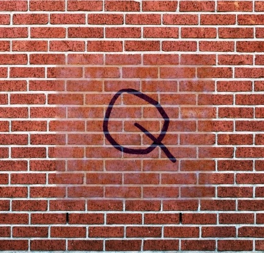

# Poisson Image Editing - A Parallel Implementation

> Jiayi Weng (jiayiwen), Zixu Chen (zixuc)

[Poisson Image Editing](https://www.cs.jhu.edu/~misha/Fall07/Papers/Perez03.pdf) is a technique that can blend two images together without artifacts. Given a source image and its corresponding mask, and a coordination on target image, this algorithm can always generate amazing result.

This project aims to provide a fast poisson image editing algorithm that can utilize multi-core CPU or GPU to handle a high-resolution image input.

## Installation

### Linux/macOS

```bash
# install cmake >= 3.4
# if you don't have sudo (like GHC), install cmake from source
# on macOS, type `brew install cmake`
$ git submodule update --init --recursive  # this is to initialize pybind11
$ pip install .
```

### Extensions

| Backend                                        | EquSolver          | GridSolver         | Dependency for installation                                  |
| ---------------------------------------------- | ------------------ | ------------------ | ------------------------------------------------------------ |
| NumPy                                          | :heavy_check_mark: | :heavy_check_mark: | -                                                            |
| GCC                                            | :heavy_check_mark: | :heavy_check_mark: | cmake, gcc                                                   |
| OpenMP                                         | :heavy_check_mark: | :heavy_check_mark: | cmake, gcc (on macOS you need to change clang to gcc-11)     |
| CUDA                                           | :heavy_check_mark: | :heavy_check_mark: | nvcc                                                         |
| MPI                                            | :heavy_check_mark: | :heavy_check_mark: | `pip install mpi4py` and mpicc (on macOS: `brew install open-mpi`) |
| [Taichi](https://github.com/taichi-dev/taichi) | :heavy_check_mark: | :heavy_check_mark: | `pip install taichi`                                         |

After installation, you can use `--check-backend` option to verify:

```bash
$ pie --check-backend
['numpy', 'taichi-cpu', 'taichi-gpu', 'taichi-cuda', 'gcc', 'openmp', 'mpi', 'cuda']
```

The above output shows all extensions have successfully installed.

## Usage

We have prepared the test suite to run:

```bash
$ cd tests && ./data.py
```

This script will download 8 tests from GitHub, and create 10 images for benchmarking (5 circle, 5 square). To run:

```bash
$ pie -s test1_src.jpg -m test1_mask.jpg -t test1_tgt.jpg -o result1.jpg -h1 -150 -w1 -50 -n 5000 -g max
$ pie -s test2_src.png -m test2_mask.png -t test2_tgt.png -o result2.jpg -h1 130 -w1 130 -n 5000 -g src
$ pie -s test3_src.jpg -m test3_mask.jpg -t test3_tgt.jpg -o result3.jpg -h1 100 -w1 100 -n 5000 -g max
$ pie -s test4_src.jpg -m test4_mask.jpg -t test4_tgt.jpg -o result4.jpg -h1 100 -w1 100 -n 5000 -g max
$ pie -s test5_src.jpg -m test5_mask.png -t test5_tgt.jpg -o result5.jpg -h0 -70 -w0 0 -h1 50 -w1 0 -n 5000 -g max
$ pie -s test6_src.png -m test6_mask.png -t test6_tgt.png -o result6.jpg -h1 50 -w1 0 -n 5000 -g max
$ pie -s test7_src.jpg -t test7_tgt.jpg -o result7.jpg -h1 50 -w1 30 -n 5000 -g max
$ pie -s test8_src.jpg -t test8_tgt.jpg -o result8.jpg -h1 90 -w1 90 -n 10000 -g max
```

Here are the results:

| #    | Source image                                                 | Mask image                                                   | Target image                                                 | Result image                |
| ---- | ------------------------------------------------------------ | ------------------------------------------------------------ | ------------------------------------------------------------ | --------------------------- |
| 1    |  |  |  |  |
| 2    |  |  |  |  |
| 3    |  |  |  |  |
| 4    |  |  |  |  |
| 5    |  |  |  |  |
| 6    |  |  |  |  |
| 7    |  | /                                                            |  |  |
| 8    |  | /                                                            |  |  |

### Backend and Solver

We have provided 6 backends. Each backend has two solvers: EquSolver and GridSolver. You can find the difference between these two solvers in the next section.

For different backend usage, please check out the related documentation under [docs/backend](/docs/backend).

For other usage, please run `pie -h` to see the hint.

## Benchmark Result

Coming soon! We are the fastest.

## Algorithm Detail

The general idea is to keep most of gradient in source image, while matching the boundary of source image and target image pixels.

The gradient is computed by

=4I(x,y)-I(x-1,y)-I(x,y-1)-I(x+1,y)-I(x,y+1))

After computing the gradient in source image, the algorithm tries to solve the following problem: given the gradient and the boundary value, calculate the approximate solution that meets the requirement, i.e., to keep target image's gradient as similar as the source image. It can be formulated as , where , where N is the number of pixels in the mask. Therefore, A is a giant sparse matrix because each line of A only contains at most 5 non-zero value.

N is always a large number, i.e., greater than 50k, so the Gauss-Jordan Elimination cannot be directly applied here because of the high time complexity O(N^3). People always use [Jacobi Method](https://en.wikipedia.org/wiki/Jacobi_method) to solve the problem. Thanks to the sparsity of matrix A, the overall time complexity is O(MN) where M is the number of iteration performed by poisson image editing.

This project parallelizes Jacobi method to speed up the computation. To our best knowledge, there's no public project on GitHub that implements poisson image editing with either OpenMP, or MPI, or CUDA. All of them can only handle a small size image workload.

### EquSolver vs GridSolver

Usage: `--method {equ,grid}`

EquSolver directly constructs the equations \vec{x}=\vec{b}) and use Jacobi method to get the solution via /4).

GridSolver uses the same Jacobi iteration, however, it keeps the 2D structure of the original image instead of re-labeling the pixel in the mask. It may take some advantage when the mask region covers all of the image, because in this case GridSolver can save 4 read instructions by directly calculating the neighborhood's coordinate. However, our preliminary result shows GridSolver is slower than EquSolver in general.

### Gradient for PIE

The [PIE paper](https://www.cs.jhu.edu/~misha/Fall07/Papers/Perez03.pdf) states some variant of gradient calculation such as Equ. 12: using the maximum gradient to perform "mixed seamless cloning". We also provide such an option in our program, with `-g {max,src,avg}`:

- `src`: only use the gradient from source image
- `avg`: use the average gradient of source image and target image
- `max`: use the max gradient of source and target image

The following example shows the difference between these three methods:

| #    | target image                                                 | --gradient=src            | --gradient=avg            | --gradient=max              |
| ---- | ------------------------------------------------------------ | ------------------------- | ------------------------- | --------------------------- |
| 3    |  |  |  |  |
| 4    |  |  |  |  |
| 8    |  |  |  |  |

## Miscellaneous (for 15-618 course project)

See [docs/report](docs/report).
